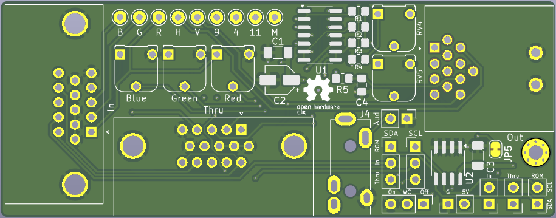
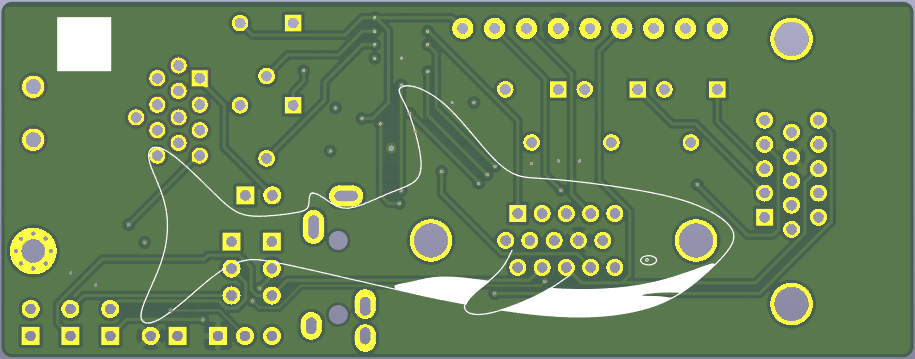
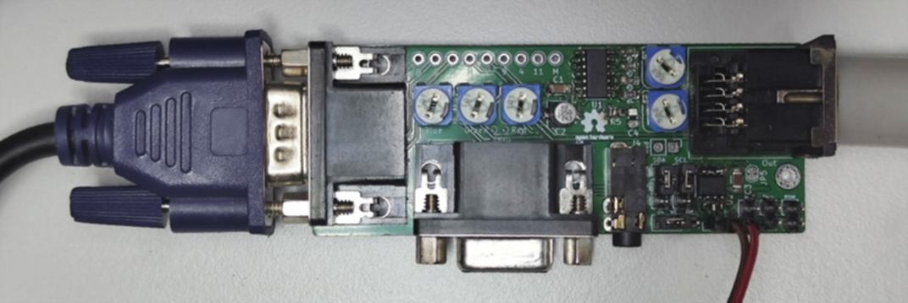

# Atari to VGA Adapter
Converts VGA signals to the 13-pin DIN connector used by Atari SM/ST Series Monochrome CRT Monitors

## Features
- Adjustable R/G/B mixdown
- Adjustable output Attenuation/Amplification
- 3.5mm jack for audio passthrough
- VGA passthrough port
- 24C02 EEPROM for custom EDID
- Jumpers for SDA/SCL selection and write-protection
- Plenty of test-points for analyzing and debugging
- Blåhaj

> [!IMPORTANT]
> Some adapters will refuse to set a mode and send signals if it doesn't receive an EDID from the connected display. To provide an EDID you need to either connect a VGA monitor via the passthrough port or install and flash the 24C02 EEPROM with a valid EEPROM, preferably matching your monitor's specs as close as possible. Then use tools like `xrandr` to refine your VGA timings.

